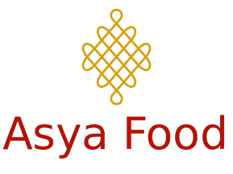
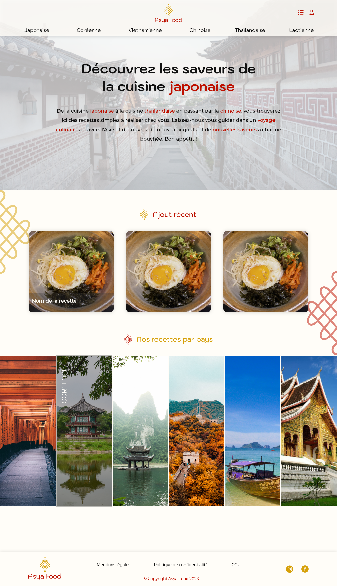
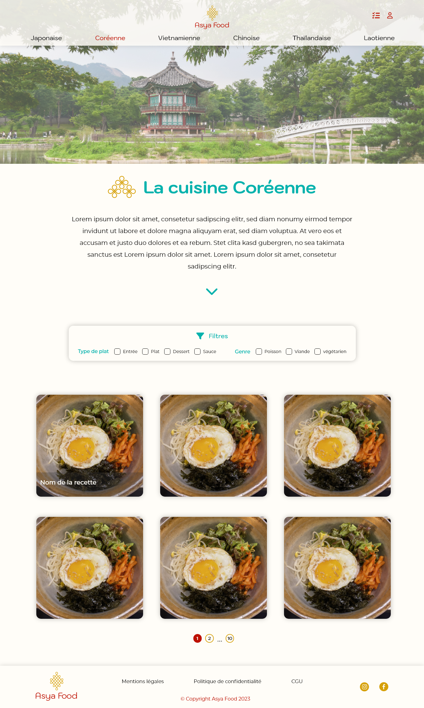
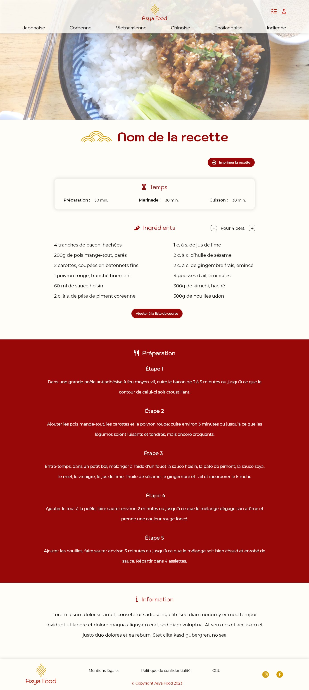
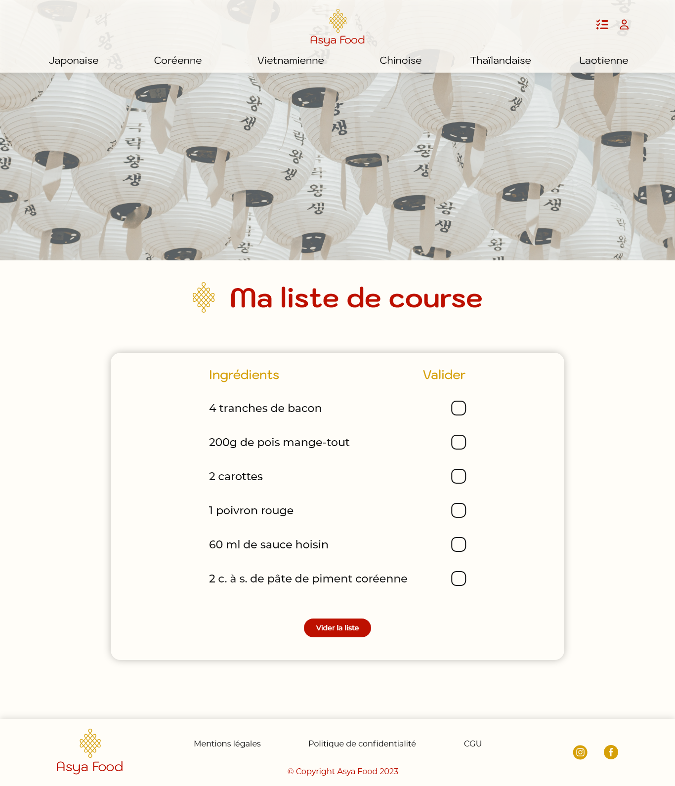

# Asya Food

**Asya Food** est une plateforme web dédiée aux **recettes asiatiques authentiques**, pensée pour être simple, rapide et intuitive.  
Le site permet de consulter des recettes, filtrer par pays ou type, convertir les portions, et générer une liste de courses automatiquement.

Ce projet correspond à la **version Bachelor**, utilisant un **front Vue 3** connecté à un **backend Symfony**.

[lien du site](https://asyafood.lauralpn.fr)

[Backend en symfony](https://github.com/laura-lpn/asyafood-backend-production-bachelor-public)

---

## Fonctionnalités

### 1. Recettes
- Fiche complète : ingrédients, étapes, temps, catégories, pays.  
- Mise en page optimisée mobile-first.  
- Conversion automatique des portions.  
- Impression PDF native.

### 2. Navigation & filtres
- Listing par pays (Chine, Japon, Corée, Vietnam…).  
- Filtres par type (entrée, plat, dessert, sauce) et genre (viande, poisson, autre).

### 3. Liste de courses
- Ajout des ingrédients depuis n’importe quelle recette.  
- Cumul automatique des quantités.  
- Cocher, supprimer, vider.

### 4. Authentification
- Inscription & connexion via **JWT**.  
- Gestion du profil utilisateur.  
- Sécurisation des pages protégées.

### 5. Back-office administrateur
- CRUD recettes.  
- CRUD ingrédients, pays, types.  
- Gestion des utilisateurs.

---

## Aperçu du projet

### Accueil

### Catégorie

### Recette

### Liste de courses

---

## Technologies

- Vue 3 (Composition API)  
- Vue Router  
- TailwindCSS
- Docker  
- Backend : **Symfony 6.3**  
  → Repo : https://github.com/laura-lpn/asyafood-backend-production-bachelor-public

---

 ## Auteure
 👩‍💻 Laura Lepannetier
Projet réalisé dans le cadre du Bachelor Développement Web.

[GitHub](https://github.com/laura-lpn)
